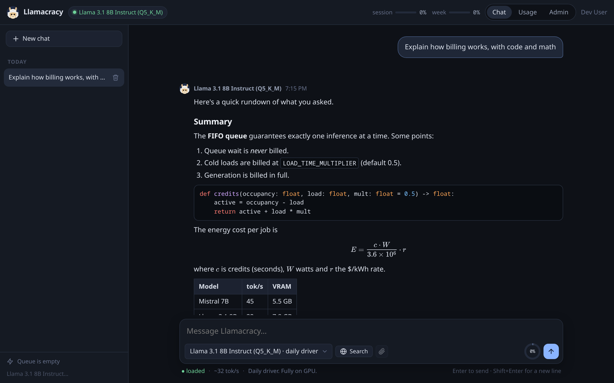

<p align="center">
  
</p>

<h1 align="center">Llamacracy</h1>

<p align="center">
  A self-hosted, multi-model LLM chat hub for you and a few friends.<br>
  One GPU, a strict FIFO queue, per-person credit metering, and an admin dashboard that knows what everyone's usage costs in electricity.
</p>

<p align="center">
  
</p>

## What it is

Llamacracy turns a single box with one consumer GPU into a small, private
"ChatGPT for the group chat". Friends sign in over a WireGuard mesh (NetBird),
pick a local GGUF model, and get streaming answers with markdown, code
highlighting and LaTeX. Every second the GPU spends on someone is measured and
charged to them as a credit, with session and weekly limits, so one heavy
user can never monopolise the machine.

It is deliberately small: a FastAPI backend, SQLite, a vanilla-JS front-end
with no build step, and [llama-swap](https://github.com/mostlygeek/llama-swap)
doing the model loading. No Docker for the app itself, no cloud APIs, no
payment processing.

## Features

- **Multi-model chat** with a model picker, per-model sampling defaults, and
  live "loaded / cold start ~4s" hints so people know what a switch costs.
- **Strict FIFO queue**, exactly one inference at a time, with a live queue
  view for everyone, cancellation that really aborts the upstream request, and
  an idle TTL that frees VRAM when nobody is around.
- **Credit metering**: `1 credit = 1 second of exclusive GPU time`, measured
  from the app's own timers, never estimated. Rolling 5-hour session and
  7-day weekly limits, per-user overrides, overshoot allowed, and a cost
  model that uses measured GPU watts and your real electricity tariff
  (time-of-use aware).
- **Rich rendering**: markdown, syntax-highlighted code, KaTeX math, a copy
  button that copies the raw source, and a context-window ring that shows how
  full the prompt is before you send.
- **Thinking on demand**: models that can reason get a Think toggle. Off by
  default; when on, the reasoning streams live under "Thinking…" and folds
  away to "Thought for 1m 26s", with a larger token budget for that turn.
- **Edit any message you sent**: the conversation forks instead of being
  rewritten. The original and its reply are kept, and `‹ 1 / 2 ›` arrows flip
  between versions, each with its own follow-ups.
- **Web search on demand**: flip a toggle and that one message gets the top
  SearXNG snippets prepended, with sources cited under it. Never a tool loop.
- **Vision on demand**: attach an image and the turn routes to the model's
  vision variant. Images live on disk, never base64 in the database.
- **Compact history**: fold the older part of a long conversation into a
  running summary, on request, billed like any other reply.
- **Account page** per user: a 30-day usage chart, self-service API keys, and
  **appearance settings** (themes, custom colours, chat text size) saved per
  account, so each person can make the app their own.
- **OpenAI-compatible `/v1` endpoint** for IDE tools such as Continue.dev,
  sharing the same queue and limits. A raw passthrough, so tool calling and
  agent mode work as well as the model underneath does.
- **Admin dashboard**: live GPU stats, users, per-model performance, "queue
  impact" fairness, billing with draft invoices and CSV export, API-key
  revocation, and per-user controls.
- **Installable PWA** on phones, over plain HTTP inside the tunnel.

## How it works

```
 browser ──HTTP over NetBird──▶ oauth2-proxy ──▶ FastAPI app ──▶ llama-swap ──▶ llama-server
                                     │              │  ▲               (one model resident)
                                     ▼              ▼  │
                                    Dex           SQLite (WAL)
                              (users + passwords)  jobs · credits · chats
```

- **Identity** comes from oauth2-proxy's forwarded headers. The app never
  writes auth code and refuses to serve if the headers are missing (unless
  `DEV_MODE=1`). Users are keyed on the OIDC `sub`, not the email.
- **The queue** (`llamacracy/queue.py`) is the core: a single worker task
  drains jobs in order, streams tokens back over SSE, learns per-model load
  times, and asks llama-swap which model is resident rather than guessing.
- **Metering** (`llamacracy/metering.py`) bills at finalisation and freezes
  the rate on each job row, so historical costs never change.
- **Models** are declared once in `bench/inventory.json`; a generator turns
  that into the llama-swap config and the app's registry.

Nothing about a specific machine is committed. Your models, measurements,
generated config, secrets and hostname all live in gitignored files that the
installer scaffolds from committed examples.

## Requirements

- Linux with an NVIDIA GPU (`nvidia-smi` is used for power sampling; the app
  falls back to a per-model estimate without it).
- Python 3.14+ and [uv](https://docs.astral.sh/uv/).
- A [llama.cpp](https://github.com/ggml-org/llama.cpp) build providing
  `llama-server`, and [llama-swap](https://github.com/mostlygeek/llama-swap)
  (a single binary, put it in `~/.local/bin`).
- GGUF models on disk.
- For multi-user use: [NetBird](https://netbird.io) (or any private
  network), Docker for Dex, and oauth2-proxy (`deploy/install.sh` downloads it).

Developed on a GTX 1080 Ti (11 GB) with 32 GB RAM. Anything llama.cpp runs
on will do; the benchmark measures what your card can actually serve.

## Quick start (single user, no auth)

```bash
git clone <this repo> && cd Llamacracy
uv sync

cp bench/inventory.example.json bench/inventory.json
$EDITOR bench/inventory.json              # 1. your models: paths + a `seed` block each
python3 bench/gen_llamaswap_config.py     # 2. writes config/llama-swap.yaml + models.json

cp .env.example .env
$EDITOR .env                              # 3. DEV_MODE=1, ADMIN_EMAILS=dev@localhost, your $/kWh

llama-swap -config config/llama-swap.yaml -listen 127.0.0.1:8091 &
uv run uvicorn llamacracy.app:app --host 127.0.0.1 --port 8000
```

Open <http://127.0.0.1:8000>. In dev mode you are a fake user with the email
from `DEV_EMAIL`; putting that email in `ADMIN_EMAILS` shows the admin
dashboard. `uv run pytest -q` runs the test suite (no GPU needed).

## Adding, changing and removing models

Every model is one entry in `bench/inventory.json`, and the two generated
files under `config/` are derived from it. The full schema is in
[bench/README.md](bench/README.md); the loop is:

```bash
$EDITOR bench/inventory.json              # add / edit / delete an entry
python3 bench/gen_llamaswap_config.py     # regenerate config/
llama-swap -config config/llama-swap.yaml -validate
llamacracy restart                        # or restart llama-swap + llamacracy by hand
```

A minimal entry:

```json
"llama31-8b": {
  "display": "Llama 3.1 8B Instruct (Q5_K_M)",
  "path": "Llama-3.1-8B-Instruct/Llama-3.1-8B-Instruct-Q5_K_M.gguf",
  "tier": "daily",
  "blurb": "Daily driver. Fully on GPU.",
  "sampling": { "temperature": 0.6, "top_p": 0.9 },
  "serve": { "ctx": 65536, "kv_type": "q8_0", "args": ["-b", "2048", "-ub", "512"] },
  "seed": { "cold_load_s": 4, "tg_tok_s": 32, "pp_tok_s": 700, "vram_used_mib": 7800 }
}
```

- `path` is relative to `models_dir` (default `~/models`) or absolute.
- `seed` is what the queue's estimates and the cost model use **until you
  benchmark**. Guess generously; nothing breaks if it is off.
- `serve` is how `llama-server` runs it: context size, KV cache type, MoE
  expert offload (`n_cpu_moe`), `--no-mmap`, extra flags.
- Add a `vision` block with the `mmproj` path and the model can read images.
- `"kind": "fim"` or `"in_picker": false` keeps a model out of the picker.

Benchmark when convenient, then regenerate:

```bash
python3 bench/phase0_bench.py --only llama31-8b     # cold load, tok/s, VRAM, watts
python3 bench/phase0_bench.py --ctx-sweep --only llama31-8b   # find the largest context that fits
python3 bench/gen_llamaswap_config.py
```

Removing a model is deleting its entry and regenerating. Its billing history
stays in the database under the old key.

## Production (friends over NetBird)

```bash
netbird up                                     # this box joins your NetBird network
./deploy/install.sh                            # scaffolds every local file, installs the units
$EDITOR bench/inventory.json && python3 bench/gen_llamaswap_config.py
$EDITOR .env                                   # ADMIN_EMAILS, electricity rate
cd deploy/dex && ./gen-hash.sh 'a-password'    # one staticPasswords entry per user in config.yaml
cd ../.. && llamacracy restart && llamacracy status
```

The installer discovers your NetBird FQDN, generates the secrets, wires the
Dex issuer and the oauth2-proxy callback to that FQDN, and installs four
systemd user units: `llama-swap`, `llamacracy`, `llamacracy-dex` and
`llamacracy-auth`. `llamacracy {up,down,restart,status,logs}` drives them
together. Users sign in at `http://<your-fqdn>:4180`.

Full runbook: [deploy/OPERATIONS.md](deploy/OPERATIONS.md). Identity provider
notes: [deploy/dex/README.md](deploy/dex/README.md). A template for the
onboarding note to send to users: [docs/WELCOME.md](docs/WELCOME.md).

## Configuration

Everything is an environment variable, documented with defaults in
[`.env.example`](.env.example): credit limits, session window, load-time
multiplier, electricity rate or time-of-use table, idle TTL, search, uploads,
and compaction. Per-user overrides are set from the admin dashboard.

## Project layout

```
llamacracy/        FastAPI app: queue, metering, identity, admin, OpenAI-compatible API
llamacracy/static/ the SPA (index.html, assets/app.js, assets/styles.css), no build step
bench/             model inventory (yours, gitignored), benchmark, config generator
config/            generated llama-swap config + model registry (gitignored)
deploy/            systemd units, install script, oauth2-proxy + Dex config, the CLI
docs/              SPEC.md (the brief), DECISIONS.md (design decisions with the why), WELCOME.md
tests/             pytest suite: queue, metering, search, and HTTP-level API tests
```

## Design notes

- [docs/SPEC.md](docs/SPEC.md) is the original brief and the source of truth
  for scope.
- [docs/DECISIONS.md](docs/DECISIONS.md) explains every non-obvious choice:
  why strict FIFO, why credits are seconds, why a second Dex, why no service
  worker, and so on.

## License

Llamacracy is free software, released under the
[GNU Affero General Public License v3.0 or later](LICENSE)
(`AGPL-3.0-or-later`).

In short: you can use, study, change and share it. If you run a modified
version as a service that other people use over a network, you must offer
those users the source code of your modified version, under the same license.
Running it unmodified, or changing it only for your own use, asks nothing of
you. The [full text](LICENSE) is what actually applies.
